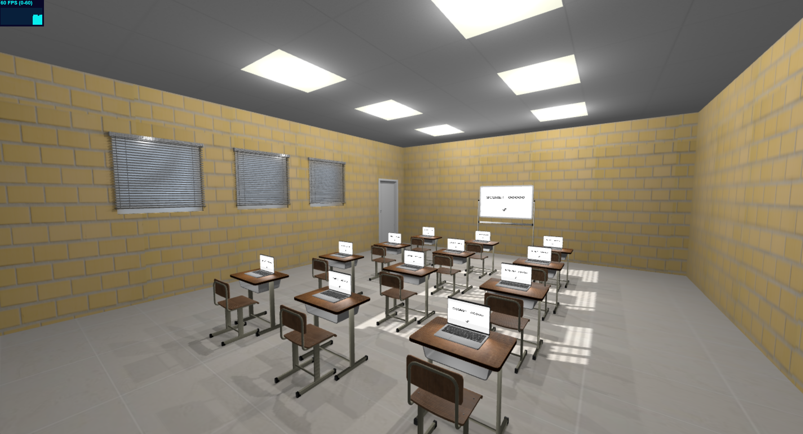
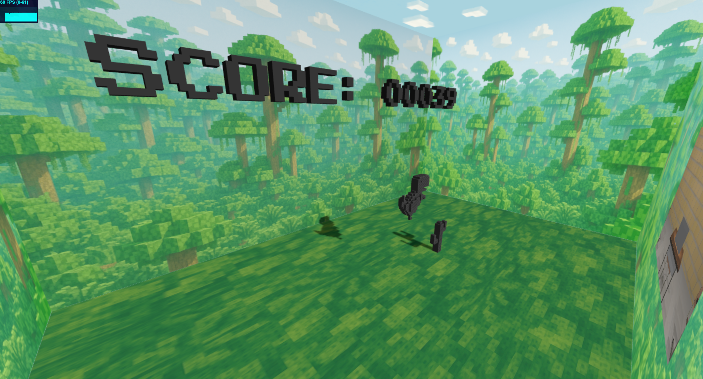

# 🦖 DinoClassroom: The No-Internet Dinosaur Portal Game

Welcome to **DinoClassroom**, a Three.js simulation where a classroom full of students with no internet has one thing left to do: play the offline Dinosaur game. But there's a twist — you can walk up to a laptop or whiteboard and **enter** the game through a 3D portal, experiencing it from inside while the classroom keeps running in sync!

---

## 🚀 Getting Started

1. **Clone the repository**:
   ```bash
   git clone https://github.com/pratplana2182197/threejs-classroom-dino.git
   cd threejs-classroom-dino
   ```

2. **Install dependencies** (requires [Node.js](https://nodejs.org/)):
   ```bash
   npm install
   ```

3. **Run the development server**:
   ```bash
   npm run dev
   ```

4. Open your browser and navigate to:
   ```
   http://localhost:5173
   ```

---

## 🎮 Gameplay & Features

- First-person 3D navigation using `W`, `A`, `S`, `D` + mouse
- Realistic classroom environment with desks, laptops, lights, and shadows
- Toggle sunlight with key `N` and ceiling lights with key `L`
- Interactive laptops and whiteboard that run the classic Dino game
- Press `E` near a laptop or screen to **enter** the Dino game through a portal
- Inside the Dino world:
  - `Space` or `Arrow Up` to jump
  - `Arrow Down` to duck
  - Camera can rotate freely
  - A screen shows the classroom view from the portal
  - Game state is preserved inside and outside the screen
  - Lights in the classroom can still be toggled

---

## 🎥 Demo Video

[▶️ Demo video on Google Drive](https://drive.google.com/file/d/1tEQ-YDced_K-q30SsACCzRa_Urt7zvG7/view?usp=drive_link)






---

## 📚 Technologies Used

- [Three.js](https://threejs.org/)
- [Vite](https://vitejs.dev/)
- JavaScript / ES6 Modules

---

## 💪 Credits

Developed as a final project for the Interactive Computer Graphics course implemented in Three.js.

---

## 🙋 Feedback

Feel free to open issues or pull requests if you have suggestions or improvements!

---

Enjoy the DinoClassroom experience!
